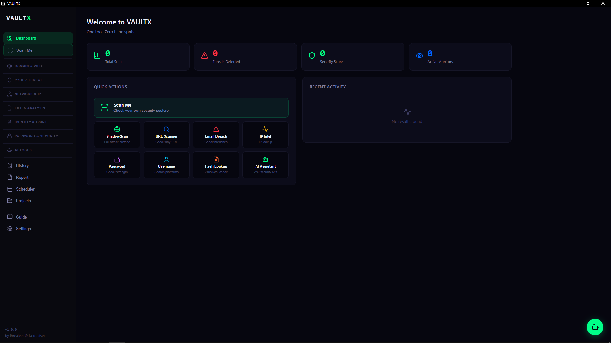

<div align="center">



# VAULTX

**One tool. Zero blind spots.**

[](https://github.com/threatvec/vaultx/releases)
[](#)
[](https://go.dev)
[](https://reactjs.org)
[](#license)
[](https://github.com/threatvec/vaultx/releases)

*by [threatvec](https://github.com/threatvec) & [talkdedsec](https://github.com/talkdedsec)*

[**Download**](https://github.com/threatvec/vaultx/releases/latest) · [**Report Bug**](https://github.com/threatvec/vaultx/issues) · [**Request Feature**](https://github.com/threatvec/vaultx/issues)

</div>

---

## What is VAULTX?

VAULTX is a native desktop cybersecurity toolkit built for security professionals, researchers, journalists, and power users. It combines **40+ OSINT, network analysis, threat intelligence, and security tools** in a single, fast, offline-capable application.

Built with **Go + React (Wails v2)**. No browser required. No cloud dependency. Your data stays on your machine, encrypted.

---

## Features

<table>
<tr>
<td width="50%">

**🌐 Domain & Web**
- ShadowScan — Full attack surface scan
- URL Scanner — Phishing & malware detection
- WHOIS Lookup — Domain registration info
- DNS Analyzer — A/MX/NS/TXT/SOA records
- SSL Inspector — Certificate & security score
- HTTP Headers — CSP/HSTS/X-Frame analysis
- Web Fingerprint — CMS/CDN/framework detect
- Phishing Detector — Typosquatting detection

</td>
<td width="50%">

**🛡️ Cyber Threat**
- NightWatch — 24/7 breach monitoring daemon
- IP Reputation — Blacklist/abuse/botnet check
- CVE Search — Vulnerability DB, CVSS scores
- Threat Feed — AbuseIPDB + AlienVault OTX

**🌍 Network & IP**
- IP Intelligence — Location/ISP/ASN/VPN/Tor
- GeoMap — Visual IP map
- Port Scanner — Async fast port scanner
- Network Tools — Ping/traceroute/DNS
- My IP Info — IP + DNS leak + WebRTC
- BGP Lookup — ASN/prefix info

</td>
</tr>
<tr>
<td width="50%">

**📁 File & Analysis**
- Metadata Extractor — PDF/Word/Excel/image
- Image EXIF — GPS/camera/date/device
- Hash Lookup — MD5/SHA → VirusTotal
- Hash Generator — MD5/SHA1/SHA256/SHA512
- QR Analyzer — QR → URL → security check
- Document Analyzer — Hidden text & macros

</td>
<td width="50%">

**👤 Identity & OSINT**
- Username Search — 100+ platforms
- Email Breach — HaveIBeenPwned check
- Phone Lookup — Country/operator/spam
- Wayback Viewer — Historical site archives
- Google Dorks — Auto dork generator
- OSINT Dashboard — Full target profile

</td>
</tr>
<tr>
<td width="50%">

**🔐 Password & Security**
- Password Analyzer — Strength + crack time
- Password Generator — Customizable & strong
- Email Header — SPF/DKIM/DMARC analysis
- 2FA Generator — TOTP (Google Auth compat.)
- Encoder/Decoder — Base64/URL/Hex/Binary
- Paste Monitor — Pastebin/Ghostbin leaks

</td>
<td width="50%">

**🤖 AI Tools**
- AI Assistant — Natural language security Q&A
- AI Risk Analysis — AI-powered scan analysis
- AI Report — Weekly security report (PDF)

**⚡ Platform Features**
- Command Palette — Ctrl+K quick navigation
- NightWatch Daemon — Background monitoring
- Smart Clipboard — Auto-detect IPs/URLs/hashes
- Scheduled Scans — Automated recurring scans
- Projects — Organize scans by workspace
- History & Logs — Detailed query history
- 3 Themes — Cyber Green / Blue / Red Alert
- 2 Languages — English & Turkish

</td>
</tr>
</table>

---

## Installation

### Download (Recommended)
1. Go to [**Releases**](https://github.com/threatvec/vaultx/releases/latest)
2. Download `vaultx-windows-amd64.exe`
3. Double-click and run — no installation needed

> **Note:** Windows Defender may show a SmartScreen warning for unsigned binaries.
> This is expected for Go/Wails applications. You can verify the file on
> [VirusTotal](https://www.virustotal.com/gui/file/8c6bd3d7df7a54c005de75365b9af1b9f314b23671bcf858472a282ca61f50dc).

### Build from Source
```bash
# Prerequisites: Go 1.22+, Node.js 18+, Wails v2
go install github.com/wailsapp/wails/v2/cmd/wails@latest

git clone https://github.com/threatvec/vaultx
cd vaultx
wails build
```

---

## API Keys (Optional)

VAULTX works without any API keys for most features. For enhanced functionality:

| Service | Used By | Free? | Link |
|---------|---------|-------|------|
| AbuseIPDB | IP Reputation, NightWatch | ✅ Free | [Get Key](https://www.abuseipdb.com/account/plans) |
| AlienVault OTX | Threat Feed | ✅ Free | [Get Key](https://otx.alienvault.com/api) |
| HaveIBeenPwned | Email Breach, NightWatch | 💰 $3.50/mo | [Get Key](https://haveibeenpwned.com/API/Key) |
| VirusTotal | Hash Lookup, URL Scanner | ✅ Free | [Get Key](https://www.virustotal.com/gui/my-apikey) |

---

## AI Support

| Provider | Type | Setup |
|----------|------|-------|
| **Ollama** | Local, 100% offline | Install [ollama.ai](https://ollama.ai), run `ollama pull llama3.2` |
| **OpenAI** | Cloud | Enter API key in Settings |
| **Anthropic Claude** | Cloud | Enter API key in Settings |
| **Google Gemini** | Cloud | Enter API key in Settings |

---

## License

Copyright © 2026 threatvec & talkdedsec. All Rights Reserved.

This software is proprietary and confidential. Unauthorized copying, distribution, or modification is strictly prohibited.

---

<div align="center">

Made with ❤️ by [threatvec](https://github.com/threatvec) & [talkdedsec](https://github.com/talkdedsec)

</div>
